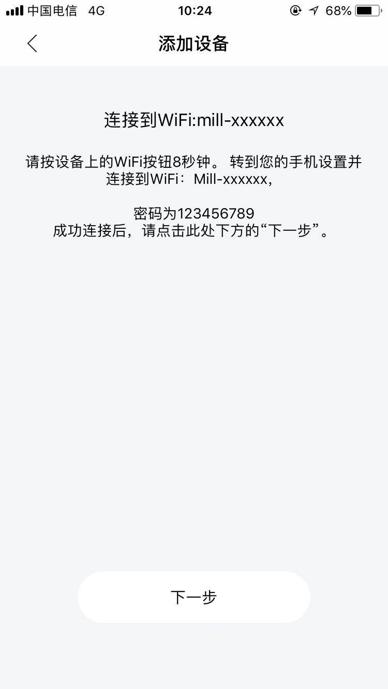

#1.6版本反馈问题总结

###智意科技
> 美国路由器无法配网成功
现在就是两个问题：
1. 设备接收不到ssid和密码；
2. 设备接收到后，App端无法发现设备。

> 通过用客户的路由器测试，设备可以接收到ssid和密码，同样的App demo，但客户那边依然收不到。

###铭泽
> 客户用的官网sdk，版本号为1.6.0，没有配网标志位，无法区分要绑定的设备。
> 处理：单独编译一版提供给客户。

###宏运科技问题
> 主域：hongyuan
主域id：4592
子域：smartboxdemo
账号：13066934473
密码：111111
1. 连接没有外网的wifi，不走超时回调
处理：sdk默认超时时间说明是60s，实际是600s。

### Mill
> ap配网不成功
> 平台账号：sunny@sekostar.cn
> 密码：gaoqin426
> 测试账号：maoxin@ablecloud.cn
> 密码：654321
> 配网密码
> 
> ![alt text][id]
[id]:mill-ap配网.jpeg "title"

### 博世私有化sdk
> 增加部分接口
> 增加获取鉴权参数接口

### 少侠科技
> 问题：单点登录的时候，如果是新手机号通过验证码登录，在刷新token后就会退出登录。注册过的号码就没有问题。
> 答复：目前已经测试有这个问题，建议用户不要在刷新token的回调中，做其它业务处理。
> 平台账号：hubin@ksmak.com
> 密码：hubin123456
> 主域：hubin
> 主域id：6598

### 赛尔富
> 问题描述：局域网通信丢包问题严重，300ms
> 答复：我们这边已经和嵌入式进行联调，未出现此情况。
