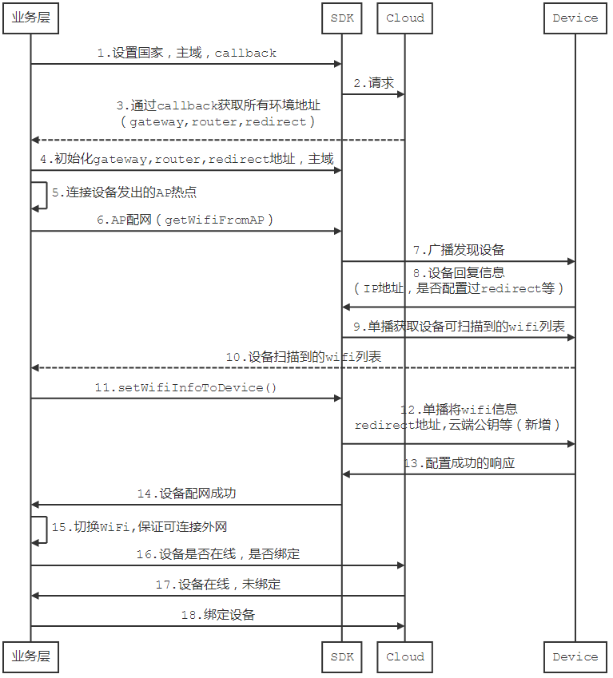

# AP配网

关于AP配网可分为以下几类，开发者可根据实际情况去调用对应的API

- 国际化AP配网（**WiFI固件版本V7及以上**）
- 非国际化AP配网（**WiFI固件版本低于V7**）

### 1.AP配网时序图



[非国际化AP配网](http://docs.ablecloud.cn/current/android/site/guide_android/ablelink/#ap%E6%A8%A1%E5%BC%8F%E9%85%8D%E7%BD%91)

### 2.具体API

####2.1 AP配网

开发者可通过`ACWifiManager`获得配网实例，完成配网；

#####第一步：获取设备可扫描到的WiFi列表

```objc
/**
 搜索设备附近可用的Wi-Fi列表
 @param callback 回调设备附近Wi-Fi列表
 */
- (void)searchDeviceAroundWifiWithcallback:(void (^)(NSArray *wifiInfo, NSError *error))callback;

```

#####第二步：将指定WiFi信息发送给设备

```objc
/**
 AP 配网

 @param ssid ssid
 @param password 密码
 @param timeout 超时时间
 @param defaultIP 是否有默认 IP
 @param callback 回调
 */
- (void)startAPLinkWithSSID:(NSString *)ssid
                   password:(NSString *)password
                    timeout:(NSTimeInterval)timeout
                  defaultIP:(NSString *)defaultIP
                   callback:(void (^)(NSArray *localDevices, NSError *error))callback;
     
```

**参数**：

- ssid:WiFi账号
- password:WiFi密码
- timeout:超时时间
- defaultIP:默认IP地址
- callback:配网回调，返回成功配网的设备列表或错误信息
