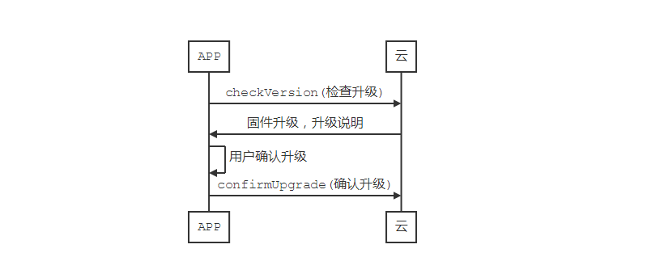

# OTA

OTA的业务由`OTAManager`来处理，开发者可通过`Matrix.otaManager()`来获取实例开发对应功能，以下是大致流程



### 1. 检查升级

```java
private void checkVersion() {
        VersionQuery versionRequest = new VersionQuery(subDomainName, otaType);
        versionRequest.setDeviceId(device.deviceId);
        Matrix.otaManager().checkVersion(versionRequest, new MatrixCallback<VersionResponse>() {
            @Override
            public void success(VersionResponse versionResponse) {
                //hasUpgrade为true则有新版，false则无新版本
                boolean hasUpgrade = versionResponse.hasUpgrade();
            }
            @Override
            public void error(final MatrixError matrixError) {
               //处理check失败的逻辑
            }
        });
    }
```

检查升级的时候需要构造一个`VersionQuery`实例，参数分别为`subDominName`,`otaType`，`otaType`有两种取值分别为：

- VersionQuery.TYPE_MCU：检查MCU升级情况
- VersionQuery.TYPE_WIFI：检查WiFi固件升级情况

### 2. 确认升级

```java
private void confirmUpgrade() {
        UpgradeRequest upgradeRequest = new UpgradeRequest(subDomainName, deviceId, targetVersion, otaType);
        Matrix.otaManager().confirmUpgrade(upgradeRequest, new MatrixCallback<Void>() {
            @Override
            public void success(Void aVoid) {// confirmUpgrade success}
            @Override
            public void error(MatrixError matrixError) {//confirmUpgrade error}
        });
    }
```

确认升级的时候需要构造一个`UpgradeRequest`实例

参数分别为：

- subDomainName：子域
- deviceId：设备的逻辑id，是设备联云激活成功之后，AbleCloud云给设备分配的Id，不是设备物理地址，或者其他产品Id
- targetVersion：确认升级的版本，是`checkVersion`方法返回的`VersionResponse`中`targetVersion`
- otaType：同检查升级的ota类型