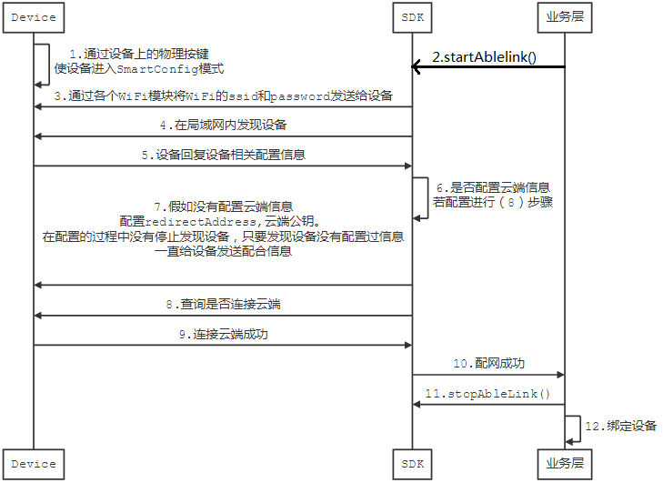

# SmartConfig配网

关于SmartConfig可分为以下几类，开发者可根据实际情况去调用对应的API

- 国际化SmartConfig配网（**WiFI固件版本V7及以上**）
  - 纯局域网配网
  - 普通SmartConfig配网(设备需要连接云端)
- 非国际化SmartConfig配网（**WiFI固件版本低于V7**）
  - 纯局域网配网
  - 普通SmartConfig配网(设备需要连接云端)

> SmartConfig配网需要各个厂家的配网库支持，目前AbleCloud支持的配网库有：
>
> ```objc
/** 庆科 */
extern NSString *const ACLinkerNameEasyLink;
/** 汉枫 */
extern NSString *const ACLinkerNameHF;
/** 联胜德 */
extern NSString *const ACLinkerNameOneshot;
/** RAK */
extern NSString *const ACLinkerNameRAK;
/** MTK */
extern NSString *const ACLinkerNameMTK;
/** 乐鑫 */
extern NSString *const ACLinkerNameESPTouch;
/** 瑞昱 */
extern NSString *const ACLinkerNameRealtek;
/** 新力维 */
extern NSString *const ACLinkerNameXLW;
/** TI */
extern NSString *const ACLinkerNameTI;
/** Marvell */
extern NSString *const ACLinkerNameMarvell;
/** 古北 */
extern NSString *const ACLinkerNameGuBei;
/** 安卓设备 */
extern NSString *const ACLinkerNameAndroid;
/** 高通 */
extern NSString *const ACLinkerNameLTLink;
/** 用户自定义 */
extern NSString *const ACLinkerNameCustom;
/** AP模式配网 */
extern NSString *const ACLinkerNameAPMode;
> ```

### 1.国际化SmartConfig配网流程



需要注意的是：**纯局域网下是没有云端配置信息，默认的是测试环境配置信息**；

[非国际化配网流程](http://docs.ablecloud.cn/current/android/site/guide_android/ablelink/)

### 2.具体API

####2.1 SmartConfig配网
无论国际化还是非国际化，在sdk内部已处理。

```objc
/**
 WIFI 配网
 @param wifiLinkerName Wifi 模块类型
 @param ssid WIFI 名称
 @param password WIFI 密码
 @param timeout 超时时间
 @param callback 配网回调
 */
- (void)startSmartLinkWithWifiLinkerName:(NSString *)wifiLinkerName
                                    SSID:(NSString *)ssid
                                password:(NSString *)password
                                 timeout:(NSTimeInterval)timeout
                                callback:(void (^)(NSArray *localDevices, NSError *error))callback;

```

**参数**：

- wifiLinkerName：第三方厂商配网库WiFi模块类型
- ssid：WiFi名称
- password：WiFi密码
- timeout：超时时间

**返回值**：

- callback：配网回调
	- localDevices：成功配网设备列表
	- error：错误信息

#### 2.2 停止配网 

```objc
/**
 停止配网
 */
- (void)stopSmartLink;

```

