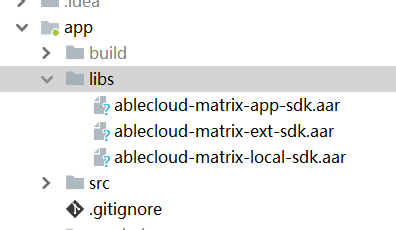

# AbleCloud Matrix SDK

AbleCloud Matrix SDK是AbleCloud推出的**iOS**平台上用于快速进行物联网APP开发的软件开发工具包。

**ac-sdk-matrix-cloud-base：**用于与AbleCloud云端交互；

**ac-sdk-matrix-local：**用于通过局域网，与适配了AbleCloud固件模块的IoT设备交互。

**ablecloud-matrix-ext-sdk：**用于扩展功能，例如：意见反馈、获取天气信息

### 1. 配置

#### 1.1 如何配置

AbleCloud提供的SDK均为`.aar`格式文件；

1. 将下载完成后的SDK放置项目的libs文件夹下；

      

2. 在项目的build.gradle文件下，将libs目录作为本地仓库，并将SDK作为依赖，另外添加`Gson（2.0+)`、`OkHttp（3.0+）`，如果使用头像、文件上传还需要添加七牛的依赖，配置如下:

   ``` groovy
   android{
       ...
       repositories {
           flatDir {
               dirs 'libs'
           }
       ...
   }
   
   dependencies {
       compile fileTree(dir: 'libs', include: ['*.jar'])
   	compile 'com.qiniu:qiniu-android-sdk:x.x.x'
       compile 'com.google.code.gson:gson:2.x.x'
       compile 'com.squareup.okhttp3:okhttp:3.x.x'
       compile(name: 'ablecloud-matrix-local-sdk', ext: 'aar')
       compile(name: 'ablecloud-matrix-app-sdk', ext: 'aar')
       compile(name: 'ablecloud-matrix-ext-sdk', ext: 'aar')
       ...
   }
   ```

3. 构建项目，完成之后就可以开始使用了。

### 2. 初始化

#### 2.1 使用前须知

SDK中的耗时操作的回调不在主线程，推荐开发者在开发过程中，如果要在回调成功结束之后进行UI操作，推荐使用RxJava、AsyncTask等完成。

#### 2.2 公有云非国际化配置

```java
Matrix.init(context,domainName,domainId,mode,region);
```

- **context**：上下文
- **dominName**：主域
- **dominId**：子域Id
- **mode**：开发环境
  - 测试环境为：0
  - 正式环境为：1
- **region**：所在区域
  - 国内：0
  - 欧洲：4
  - 北美：3
  - 东南亚：1

#### 2.3 公有云国际化配置

使用国际化，意味App连接服务器地址动态获取，所以第一步需要获取对应URL

##### 2.3.1 获取URL

```java
Matrix.configGlobal(dominName, mode, country, new MatrixCallback<String>() {
    @Override
    public void success(String s) {
     //获取到该主域下国家和环境对应的URL
    }

    @Override
    public void error(MatrixError matrixError) {
    	e.onError(matrixError);
    	}
    });

// mode:测试环境为：0,正式环境为：1
// country:国家代码
```

返回示例：

```json
{
	"matchedRegion": {
		"id": "test",
		"redirectDomain": "test.ablecloud.cn:9100",
		"routerDomain": "test.ablecloud.cn:9005",
		"webSocketDomain": "test.ablecloud.cn:9001"
	},
	"regionList": [{
		"id": "test",
		"redirectDomain": "test.ablecloud.cn:9100",
		"routerDomain": "test.ablecloud.cn:9005",
		"webSocketDomain": "test.ablecloud.cn:9001"
	}]
}
```

##### 2.3.2 根据上述返回结果进行初始化配置

开发者可以自主选择连接的环境

```java
Matrix.initI18N(activity.this.getApplicationContext(), dominName, dominId, routerDomain, webSocketDomain, redirectDomain, id);
```

#### 2.4 私有云配置

```java
private Configuration privateConfiguration = new Configuration() {
        @Override
        public String getRouterAddress() {return routerAddress;}
        @Override
        public String getGatewayAddress() {return webSocketAddress;}
        @Override
        public String getDomainName() {return dominName;}
        @Override
        public String getRedirectAddress() {return redirectAddresss(可为null);}
        @Override
        public String getRegionDes() {return regions(可为null);}
        @Override
        public long getDomainId() {return dominId;}
    };
Matrix.init(this, privateConfiguration);
```
