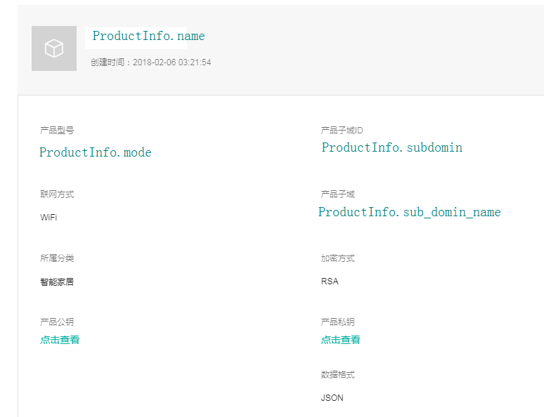

# 产品管理

产品管理由以下类组成：

- 业务逻辑类：`ProductManager` 
开发者通过产品管理功能，获取在AbleCloud云端创建的产品信息，包括：产品的名称、产品型号、主子域信息；

- 产品模型类：`ACProduct`
	

### 1. 涉及的数据结构 -- ACProduct

```objc
@interface ACProduct : NSObject

/** 主域ID */
@property (nonatomic, assign, readonly) NSInteger domainID;

/** 主域名称 */
@property (nonatomic, copy, readonly) NSString *domainName;

/** 子域ID */
@property (nonatomic, assign, readonly) NSInteger subDomainID;

/** 子域名称 */
@property (nonatomic, copy, readonly) NSString *subDomainName;

/** 产品名称 */
@property (nonatomic, copy, readonly) NSString *name;

/** 产品型号 */
@property (nonatomic, copy, readonly) NSString *model;

/** 产品图片链接 */
@property (nonatomic, copy, readonly) NSString *imageURL;

/** 产品描述 */
@property (nonatomic, copy, readonly) NSString *infoDescription;

/**
 使用字典初始化

 @param dictionary 属性字典
 @return 本类对象
 */
+ (instancetype)productWithDictionary:(NSDictionary *)dictionary;

@end
```



### 2. API

```objc
/**
 获取所有产品信息

 @param callback 所有产品信息回调
 */
+ (void)fetchAllProducts:(void (^)(NSArray<ACProduct *> *productArray, NSError *error))callback;
```

获取该主域下所有的产品信息

参数：

- callback：所有产品的集合

---

```objc
/**
 根据子域名称获取产品信息

 @param subDomainName 产品子域名称
 @param callback 子域对应产品信息回调
 */
+ (void)fetchProductWithSubDomainName:(NSString *)subDomainName
                             callback:(void (^)(ACProduct *product, NSError *error))callback;
```

获取指定产品的信息

参数：

- subDomainName：产品的子域名称

---

