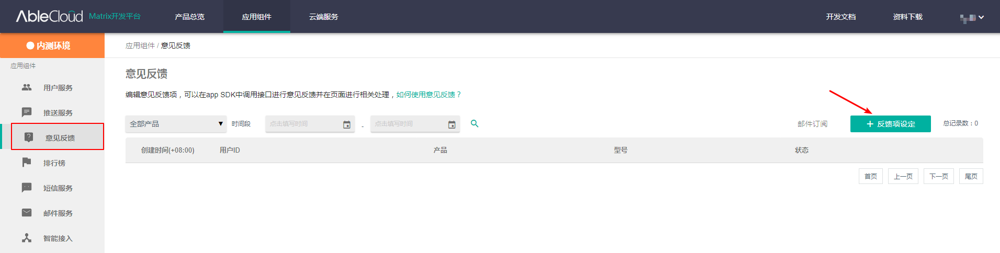

# 意见反馈

AbleCloud提供APP端的用户意见反馈接口。主要的业务逻辑`FeedbackHelper`来负责，开发者可以开发用户提交意见的页面。用户意见反馈可以反馈的项由开发者自己定义。 使用意见反馈前,需要先在控制台设置反馈项参数；



### 1. 代码示例

```java
final File[] attachments = {new File(dir, "feedback1.png"), new File(dir, "feedback2.png")};

Observable.fromArray(attachments).flatMapSingle(new Function<File, SingleSource<String>>() {
    @Override
    public SingleSource<String> apply(final File file) throws Exception {
        return Single.create(new SingleOnSubscribe<String>() {
            @Override
            public void subscribe(final SingleEmitter<String> e) throws Exception {
                FeedbackHelper.uploadAttachment(file, null, new MatrixCallback<String>() {
                    @Override
                    public void success(String s) {e.onSuccess(s);}
                    @Override
                    public void error(MatrixError matrixError) {e.onError(matrixError);}
                });
            }
        }).timeout(BLOB_TIMEOUT_MS, TimeUnit.MILLISECONDS);
    }
}).collectInto(new ArrayList<String>(), new BiConsumer<List<String>, String>() {
    @Override
    public void accept(List<String> strings, String s) throws Exception {
        strings.add(s);
    }
}).flatMapCompletable(new Function<ArrayList<String>, CompletableSource>() {
    @Override
    public CompletableSource apply(final ArrayList<String> strings) throws Exception {
        return Completable.create(new CompletableOnSubscribe() {
            @Override
            public void subscribe(CompletableEmitter e) throws Exception {
                Map<String, Object> extend = new HashMap<>();
                extend.put("description", "feedback: " + new Date().toString());
                extend.put("pictures", strings);
                FeedbackHelper.submitFeedback(null, null, extend, new CompletableCallback<>(e, Void.class));
            }
        }).timeout(TIMEOUT_MS, TimeUnit.MILLISECONDS);
    }
}).blockingAwait();
```

示例中涉及两个方法

```java
static void uploadAttachment(File file, MatrixCallback<Integer> progress, MatrixCallback<String> callback)
```

上传意见反馈中的图片

参数

- file：图片
- progress：上传进度
- callback：图片存储的地址（URL）

---

```java
static void submitFeedback(String subDomain, String type, Map<String, Object> extend, final MatrixCallback<Void> callback)
```

提交意见反馈

参数：

- subDomin：子域，可以为空,也可以指定subDomain产品
- type：预留字段，可以为空 
- extend：提交的具体信息，key为在云端创建的字段，value为提交的值 

---