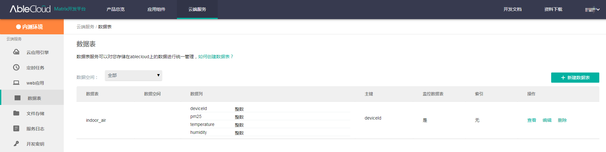

## 订阅UDS数据集

对于存储在数据集中的数据，APP可以进行实时消息订阅，进行订阅后，APP和云端建立**长连接**, 数据集中的数据发生改变后，云端会将最新的数据实时推送给APP 

使用之前, 需要先到AbleCloud中控制台查看对应的数据集 



> 1. 数据集对象中涉及到字符串比较多, 如果遇到订阅失败请检查拼写是否正确
> 2. 如果一个数据集有两个及以上主键, 则必须按顺序订阅, 即如果要订阅主键二, 则实现方式为订阅主键一和主键二, 不能单独订阅主键二
> 3. 如果主键是设备Id, 那么该设备必须**与当前用户是绑定关系**

```java
void subscribe(String className, Map<String, Object> primaryKey, int opType, MatrixCallback<Void> callback)
```

订阅数据集

参数：

- className：数据表名，例如上述图中：indoor_air
- primaryKey：主键 例如上述图：`primaryKey.put("deviceId",6)`监听deviceId==6的数据
- opType：
  - ClassTopic.OPTYPE_CREATE：数据创建
  - ClassTopic.OPTYPE_REPLACE：数据替换
  - ClassTopic.OPTYPE_UPDATE：数据更新
  - ClassTopic.OPTYPE_DELETE：数据删除
  - ClassTopic.OPTYPE_ALL：数据所有写操作

---

```java
void registerDataReceiver(ClassDataReceiver receiver)
```

注册监听

参数：

- receiver：监听

  ```java
  public interface ClassDataReceiver {
      /**
       * 接收实时数据
       *
       * @param className 数据集名称
       * @param value     JSON格式数据
       */
      void onReceive(String className, int opType, String value);
  }
  ```

---

```java
void unsubscribe(String className, Map<String, Object> primaryKey, int opType, MatrixCallback<Void> callback)
```

取消订阅

参数：

- className：数据表名，例如上述图中：indoor_air
- primaryKey：主键 例如上述图：`primaryKey.put("deviceId",6)`监听deviceId==6的数据
- opType：
  - ClassTopic.OPTYPE_CREATE：数据创建
  - ClassTopic.OPTYPE_REPLACE：数据替换
  - ClassTopic.OPTYPE_UPDATE：数据更新
  - ClassTopic.OPTYPE_DELETE：数据删除
  - ClassTopic.OPTYPE_ALL：数据所有写操作

---

```java
void unregisterDataReceiver(ClassDataReceiver receiver)
```

移除监听

---