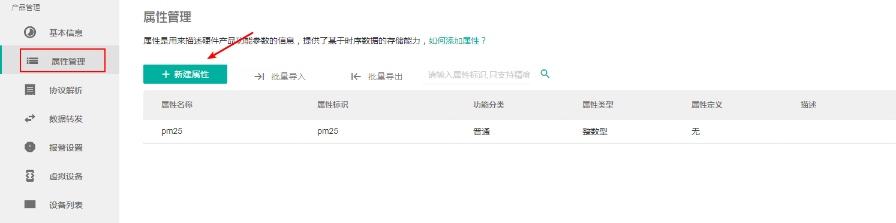

## 设备属性订阅和加速上报

本节包括设备属性订阅、加速上报；

要进行属性订阅，需要先在平台创建设备属性，如下：



### 1. 设备属性订阅

要完成设备的属性订阅，完整的过程需要经过三个步骤

1. 订阅
2. 设置设备属性订阅回调
3. 取消订阅

```objc
/**
 订阅设备属性推送消息
 
 @param subDomain 订阅设备的子域
 @param deviceId 订阅设备的逻辑id
 */
+ (void)subscribePropDataWithSubDomain:(NSString *)subDomain
                              deviceId:(NSInteger)deviceId
                              callback:(void(^)(NSError *error))callback;
```
订阅一台设备的属性

参数：

- subDomain：子域
- deviceId：设备的逻辑id，是设备联云激活成功之后，AbleCloud云给设备分配的Id，不是设备
  物理地址，或者其他产品Id

---

```objc
/**
 * 设置设备类型信息接收回调
 * @param handler 用于回调消息
 */
+ (void)setPropertyMessageHandler:(void(^)(NSString *subDomain,
                                           NSInteger deviceId,
                                           NSDictionary *properties))handler;
```

设置设备属性订阅回调

参数：

- handler：业务层需要实现接收到订阅属性时的处理。

---

```objc
/**
 取消订阅设备属性推送消息
 
 @param subDomain 订阅设备的子域
 @param deviceId 订阅设备的逻辑id
 */
+ (void)unSubscribePropDataWithSubDomain:(NSString *)subDomain
                                deviceId:(NSInteger)deviceId
                                callback:(void(^)(NSError *error))callback;
```

取消一台设备的订阅

参数：

- subDomain：子域
- deviceId：设备的逻辑id，是设备联云激活成功之后，AbleCloud云给设备分配的Id，不是设备
  物理地址，或者其他产品Id
- callback：取消订阅回调

---

```objc
/**
 * 取消订阅所有设备属性推送消息
 */
+ (void)unSubscribeAllDevicePropData;
```

取消所有设备的属性订阅

---

**注意：订阅动作只执行一次即可，订阅属性的回调可以在任何地方设置，并根据不同页面需求设置不同的回调处理**

---

### 2. 加速上报

在开发过程中，当APP打开时，有些设备属性的值是比较看重实时性的，例如温度、PM2.5、TDS值等，这时候需要设备加快上报的速率；

```objc
/**
 * 加速MCU上报数据的频率
 * @param deviceId  逻辑id
 * @param subDomain 子域
 * @param interval  查询间隔可设置为(0, 60]秒
 */
+ (void)enableDeviceFastReport:(NSInteger)deviceId
                     subDomain:(NSString *)subDomain
                      interval:(NSInteger)interval
                      callback:(void(^)(NSError *error))callback ;
```

加速设备上报

参数：

- subDomain：子域
- deviceId：设备的逻辑id，是设备联云激活成功之后，AbleCloud云给设备分配的Id，不是设备
  物理地址，或者其他产品Id
- interval：控制设备上报数据的间隔时间 范围限制为：(0, 60] 秒。 
- callback：回调

---

```objc
/**
 * 取消加速指定设备MCU上报数据的频率
 * @discussion      3分钟后才会停止快速上报
 * @param deviceId  逻辑id
 * @param subDomain 子域
 */
+ (void)disableDeviceFastReport:(NSInteger)deviceId
                      subDomain:(NSString *)subDomain;
```

取消设备的加速上报

参数：

- deviceId：设备的逻辑id，是设备联云激活成功之后，AbleCloud云给设备分配的Id，不是设备
  物理地址，或者其他产品Id
- subDomain：子域

---

```objc
/**
 取消加速所有设备MCU上报数据的频率
 */
+ (void)disableAllDeviceFastReport;
```

取消所有设备的加速上报

---


